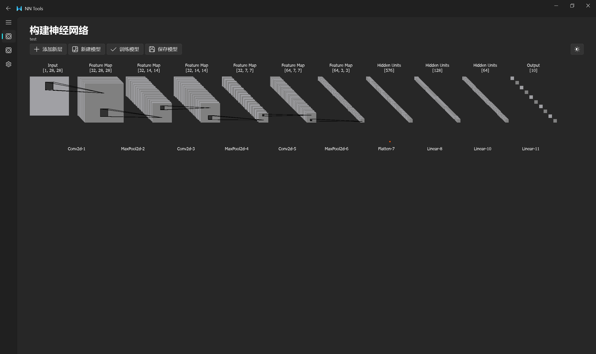
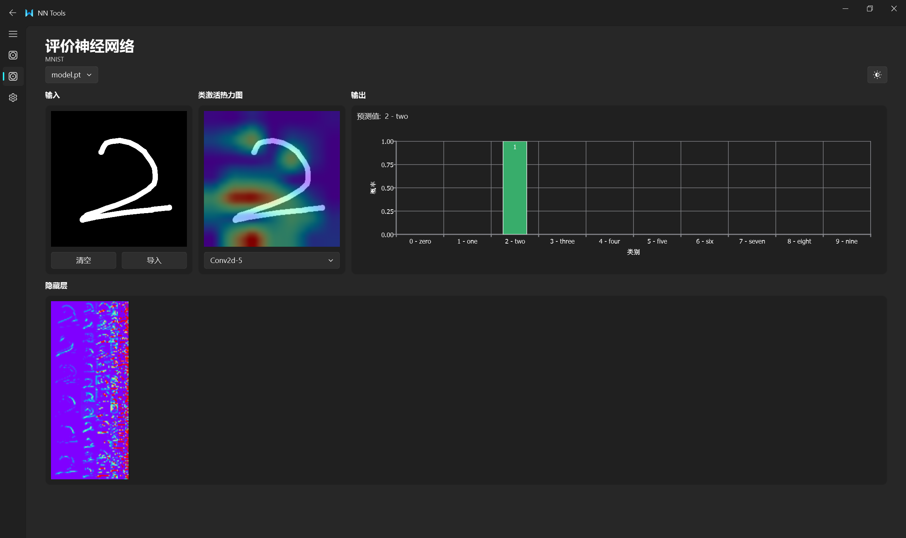

# NN Tools

NN Tools 是一个基于 PySide6 和 qfluentwidgets 的神经网络工具，旨在帮助用户构建和评估神经网络模型。该项目包含一个图形用户界面（GUI），用户可以通过该界面进行神经网络模型的构建和评估。

该工具仍在开发中，会逐渐完善功能

## 前置条件

- Python 3.9 或更高版本
- PySide6
- qfluentwidgets
- PyTorch
- CUDA(可选)

## 运行方法

1. 克隆或下载项目到本地。
2. 确保已安装所有前置条件。

   ```bash
   pip install -r requirement.txt
   ```
3. 在项目根目录下运行 `GUI.py` 文件。

   ```bash
   python -u GUI.py
   ```
   
第一次运行时需要下载MNIST数据集，请确保网络畅通

## 功能预览

构建神经网络



评估神经网络


